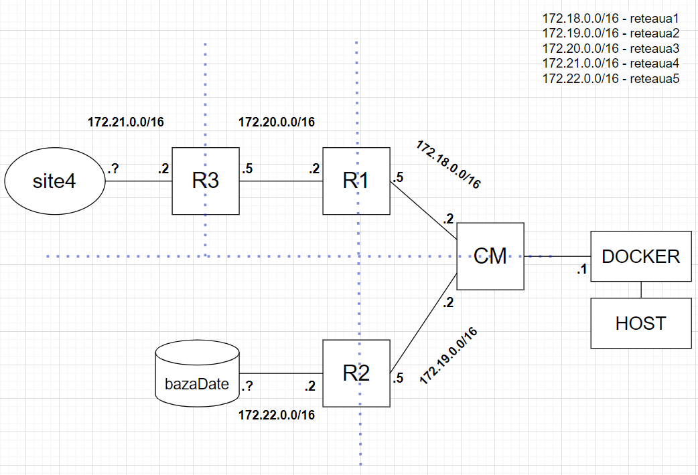

# Docker automated services generator

The project generates a static infrastructure on which service containers like HTTP servers or databases could be automatically generated. Each service container can be customized and the infrastructure (Rx and CM containers in the picture) will act like virtual routers (and switches if multiple containers are added in the same network).

Requirements: Windows OS, Docker, Docker Compose and the correct path set in licenta_compose.bat file. 